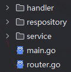

# \[后端] Gin 框架分层：经典的洋葱模型

## 分层前

大三的数据库课设，用 Go 写了一个基于 Gin 框架的项目，随着代码量的增加，Router 文件变得异常臃肿。

最初的代码是这样：

```go
r.POST("/login", func(c *gin.Context) {
    var req LoginRequest
    if err := c.ShouldBindJSON(&req); err != nil {
    c.JSON(400, gin.H{"error": "参数错误"})
    return
    }
    user, err := db.FindUser(req.Username)
    if err != nil || user.Password != req.Password {
        c.JSON(401, gin.H{"error": "认证失败"})
        return
    }
    
    token := generateToken(user)
    c.JSON(200, gin.H{"token": token})
})
```

所有的参数解析、业务逻辑、数据库操作和响应返回全挤在一个匿名函数里。好处是初期代码调试很方便，缺点……代码一多起来就不是人看的了。

于是我参考 **SpringBoot** 的分层设计，
将框架拆为：Controller (Handler) -> Service -> Repository。

- Controller(Handler) 层：只负责解析参数和返回响应。

- Service 层：负责核心业务逻辑。我在大三软件工程课设小组里负责架构设计时，是这样和组员解释的：
**只要一个功能他不和请求本身打交道，又不和数据库打交道，那么它就可以放在 Service 层。**

- Repository 层：只负责 CRUD,和数据库打交道，不关心具体业务背景。

## 分层后
分层重构之后，代码变成了这样：
Controller 层
```go
    func LoginHandler(c *gin.Context) {
    var req dto.LoginRequest
    if err := c.ShouldBindJSON(&req); err != nil {
    response.Error(c, 400, "参数错误")
    return
    }
```
Service 层
```go
    token, err := userService.Login(req)
    if err != nil {
        response.Error(c, 401, "登录失败")
        return
    }
    
    response.Success(c, gin.H{"token": token})
}
```


这里有一个很微妙的变化：gin.Context 止步于 Controller 层。

询问 AI 得知：gin.Context 是一个重型的上下文对象，包含了请求和响应的所有细节。如果把它传递给 Service 层，就意味着业务逻辑要和 Gin 框架的请求深度耦合了。

一旦未来要把 Service 的代码挪到一个 RPC 框架中，就会发现因为满地都是 gin.Context，代码根本动不了。

总结

分层设计不是为了增加文件夹的数量，而是为了职责分离。Controller 关心 HTTP 协议，Service 关心业务规则，Repository 关心数据存储。

正如 Java 的 TypeReference 解决了类型擦除的尴尬，Gin 的分层设计则解决了 Web 开发中逻辑混乱的难题。虽然前期多写了一些接口和结构体，但当项目规模扩大时，清晰的边界感才是高效开发的保证。